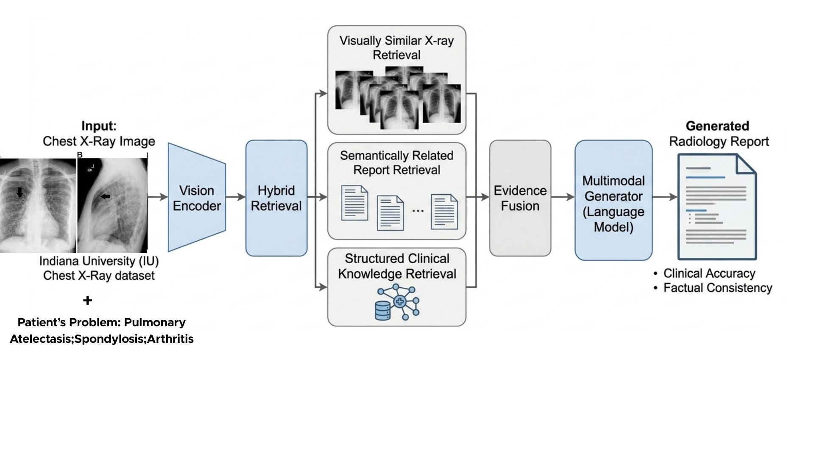

# RRGE-RAG: Radiology Report Generation Enhancement Using Hybrid Retrieval-Augmented Generation

RRGE-RAG is a research project for automated chest X-ray radiology report generation using a Hybrid Retrieval-Augmented Generation framework. The project aims to improve the factual correctness, clinical relevance, and reliability of generated reports by combining visual image features, structured clinical labels, and retrieved case-based evidence.

This work extends the R2Gen radiology report generation framework by incorporating BioViL-T visual encoding, hybrid retrieval, multimodal fusion, and uncertainty-aware evaluation.

---

## Project Overview

Automated radiology report generation is an important application of medical artificial intelligence. Traditional image-to-text models generate reports directly from chest X-ray images, but they may produce incomplete, generic, or clinically inaccurate descriptions.

To address this limitation, this project proposes RRGE-RAG, a Hybrid Retrieval-Augmented Generation framework that retrieves similar prior cases and uses them as additional clinical evidence during report generation.

The framework integrates three types of information:

- Chest X-ray image features
- Structured clinical labels
- Retrieved similar radiology reports

By combining these sources, the model aims to generate reports that are more clinically meaningful, coherent, and reliable.

---

## Key Contributions

- Extended the R2Gen architecture for hybrid retrieval-augmented radiology report generation
- Used BioViL-T as a domain-specific chest X-ray image encoder
- Incorporated hybrid retrieval using visual, textual, and structured clinical label similarity
- Retrieved top-3 similar cases as external clinical evidence
- Applied attention-based multimodal fusion for report generation
- Evaluated generated reports using lexical, clinical, and uncertainty-aware metrics
- Analyzed uncertainty estimation using entropy, MC dropout variance, ECE, and Brier Score

---

## Dataset

This project uses the Indiana University Chest X-ray dataset.

Dataset link:  
https://www.kaggle.com/datasets/raddar/chest-xrays-indiana-university

Each sample contains:

- Frontal and lateral chest X-ray images
- Radiology report sections such as Findings and Impression
- Structured clinical labels from the `Problems` column

After preprocessing and filtering, the final dataset contains 3,337 aligned samples with image, text, and structured label information.

---

## Methodology

The proposed RRGE-RAG framework follows a multimodal retrieval-augmented pipeline.



### 1. Image Encoding

Chest X-ray images are encoded using BioViL-T to extract medical-domain visual embeddings.

### 2. Hybrid Retrieval

The system retrieves the top-3 most similar prior cases using:

- Image similarity
- Report text similarity
- Structured clinical label similarity

### 3. Multimodal Fusion

The visual embedding, retrieved reports, and clinical labels are combined using an attention-based fusion mechanism.

### 4. Report Generation

The fused multimodal representation is passed into the R2Gen decoder to generate the final radiology report.

### 5. Uncertainty Estimation

The model output is analyzed using uncertainty-aware methods, including entropy-based uncertainty and MC dropout variance.

---

## Pipeline

```text
Chest X-ray Image
        |
        v
BioViL-T Image Encoder
        |
        v
Hybrid Retrieval
(Image + Text + Clinical Labels)
        |
        v
Top-K Retrieved Similar Cases
        |
        v
Attention-Based Multimodal Fusion
        |
        v
R2Gen Decoder
        |
        v
Generated Radiology Report
        |
        v
Evaluation and Uncertainty Analysis
```
## Baseline Models

The proposed model is compared with several established radiology report generation baselines:

| Model         | Description                                                       |
| ------------- | ----------------------------------------------------------------- |
| R2Gen         | Transformer-based image-to-text radiology report generation model |
| R2GenCMN      | R2Gen with cross-modal memory network                             |
| PPKED         | Knowledge-enhanced radiology report generation model              |
| METransformer | Transformer-based model for medical report generation             |
| RRGE-RAG      | Proposed hybrid retrieval-augmented generation model              |

## Evaluation Metrics

The system is evaluated using three categories of metrics:

### Lexical Metrics

- BLEU-1
- BLEU-2
- BLEU-3
- BLEU-4
- ROUGE-L

### Clinical Metrics

- RadGraph F1
- CheXbert 14-class Macro F1
- CheXbert 14-class Micro F1

### Uncertainty and Calibration Metrics

- Expected Calibration Error
- Brier Score
- Entropy-based uncertainty
- MC Dropout variance

## Research Questions

This project investigates the following research questions:

1. How does retrieval-augmented generation influence the accuracy and clinical relevance of automated radiology report generation compared to traditional image-to-text models?

2. To what extent does multimodal fusion of X-ray images, clinical labels, and retrieved case information improve the coherence and completeness of generated radiology reports?

3. How well do uncertainty estimates correlate with generation quality, and how well are they calibrated?

## Experimental Results

| Model         |      BL-1 |      BL-2 |      BL-3 |      BL-4 |   ROUGE-L |     RG-F1 |   14Ma-F1 |   14Mi-F1 |       ECE |     Brier |
| ------------- | --------: | --------: | --------: | --------: | --------: | --------: | --------: | --------: | --------: | --------: |
| R2Gen         |     0.479 | **0.479** |     0.103 |     0.082 |     0.483 |     0.242 |     0.079 |     0.376 |     0.088 |     0.087 |
| R2GenCMN      |     0.362 |     0.267 |     0.203 |     0.153 | **0.545** |     0.254 | **0.097** | **0.717** | **0.040** | **0.040** |
| PPKED         |     0.099 |     0.052 |     0.032 |     0.021 |     0.178 |     0.247 |     0.040 |     0.423 |     0.076 |     0.076 |
| METransformer | **0.483** |     0.322 | **0.228** | **0.172** |     0.480 | **0.311** |     0.074 |     0.080 |     0.078 |     0.079 |
| RRGE-RAG      |     0.384 |     0.231 |     0.155 |     0.110 |     0.315 |     0.235 |     0.064 |     0.356 |     0.076 |     0.077 |

## Ablation Study

The ablation study evaluates the contribution of labels, retrieval, and the full hybrid fusion mechanism.

| Model         | Description                                                |
| ------------- | ---------------------------------------------------------- |
| A0            | Image-only baseline using R2Gen                            |
| A1            | Image features with structured clinical labels             |
| A2            | Image features with retrieved reports                      |
| A3 / RRGE-RAG | Full hybrid model using image, labels, and retrieved cases |

| Model    |  BL-1 |  BL-2 |  BL-3 |  BL-4 | ROUGE-L | RG-F1 | 14Ma-F1 | 14Mi-F1 |   ECE | Brier |
| -------- | ----: | ----: | ----: | ----: | ------: | ----: | ------: | ------: | ----: | ----: |
| A0       | 0.479 | 0.479 | 0.103 | 0.082 |   0.483 | 0.242 |   0.079 |   0.376 | 0.088 | 0.087 |
| A1       | 0.060 | 0.015 | 0.004 | 0.041 |   0.058 | 0.011 |   0.078 |   0.376 | 0.087 | 0.088 |
| A2       | 0.221 | 0.146 | 0.102 | 0.068 |   0.302 | 0.225 |   0.053 |   0.250 | 0.059 | 0.058 |
| RRGE-RAG | 0.384 | 0.231 | 0.155 | 0.110 |   0.315 | 0.254 |   0.064 |   0.356 | 0.076 | 0.077 |


## Results Summary

The experimental results show that RRGE-RAG achieves competitive performance across lexical, clinical, and uncertainty-aware evaluation metrics. Although the proposed method does not outperform all baseline models in every metric, it demonstrates the potential of combining retrieval, structured clinical labels, and visual features for more reliable radiology report generation.

The ablation study shows that retrieval contributes positively to report generation quality, while multimodal fusion remains challenging. The uncertainty evaluation also indicates that calibration and confidence estimation are important areas for future improvement.


## Project Structure

```text
NLU-Project-Wave2Vec/
│
├── A1_Ablation/                 # Ablation experiment files for the text-only baseline
│
├── App/                         # Web application for radiology report generation
│   ├── backend/                  # Backend API and model-serving logic
│   ├── frontend/                 # Frontend user interface
│   └── docs/                     # Application documentation
│
├── Dataset/                     # Dataset files, preprocessing resources, and metadata
│
├── Litereture Review/           # Literature review materials and related research papers
│
├── Outputs/                     # Generated reports, predictions, and evaluation outputs
│
├── Progress/                    # Progress report and intermediate project documents
│
├── R2Gen/                       # R2Gen baseline implementation
│   ├── modules/                  # Model architecture and training modules
│   └── main.py                   # Main training and evaluation script
│
├── R2GenCMN/                    # R2GenCMN baseline implementation
│
├── Report/                      # Final report, academic writing, and documentation files
│
├── figure/                      # Figures, diagrams, result charts, and visualizations
│
├── notebook/                    # Jupyter notebooks for experiments and analysis
│
├── .gitignore                   # Git ignored files
├── .DS_Store                    # macOS system file
└── README.md                    # Main project documentation
```

## How to Run

From the project root directory:

```
cd backend
uvicorn app:app --reload
```
Then open:

```
http://127.0.0.1:8000/docs
```

## How to deploy

``` 
Step 1: Deploy the backend on Render and ensure the service is live

Step 2: Make sure GitHub Pages is enabled for the repository

Step 3: Open the frontend using the GitHub Pages link

Step 4: Upload X-ray images and click Generate Report

```

## Authors
 - Vibolrottana Seng (st126425)
 - Zwe Yu Ya Kyaw Zin Oo (st125990)
 - Dakchhyeta Bade Shrestha (st126671)
 - Supipi Karunathilaka (st126489)


